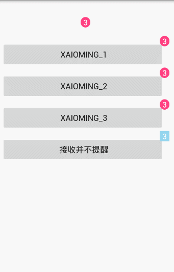

# StickyDot
仿QQ取消控件。拖拽效果，爆炸效果。 酷炫的、人性化的效果。
性能颇佳，如行云流水。



## 引用
```groovy
// 项目引用
dependencies {
     compile 'com.github.LidongWen:StickyDot:1.1.0'
}

// 根目录下引用

allprojects {
    repositories {
        jcenter()
        maven { url "https://www.jitpack.io" }
    }
}
```

## 代码使用
```java
hepler = new StickyDotHepler(mContext, view, dragView)
//      .setMaxDragDistance(DensityUtils.dip2px(mContext, 200))//设置拖拽距离
//      .setColor(Color.parseColor("#94D5EE"))//设置颜色
//      .setDraged(false)  //设置是否可以被拖拽
        .setOutListener(new StickyDotHepler.StickyListener() {  //监听
            @Override
            public void outRangeUp(PointF dragCanterPoint) {

            }
        });

//      hepler.dismiss();// 取消
```
